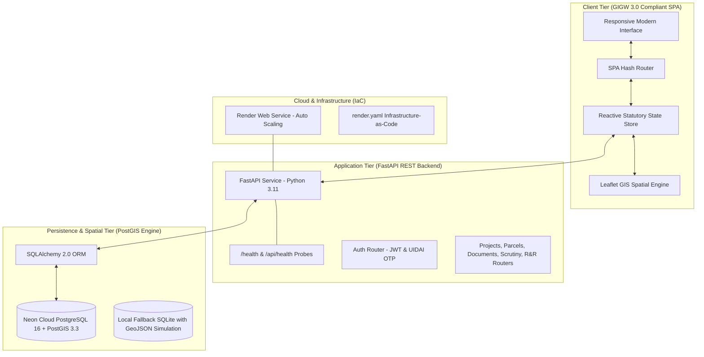
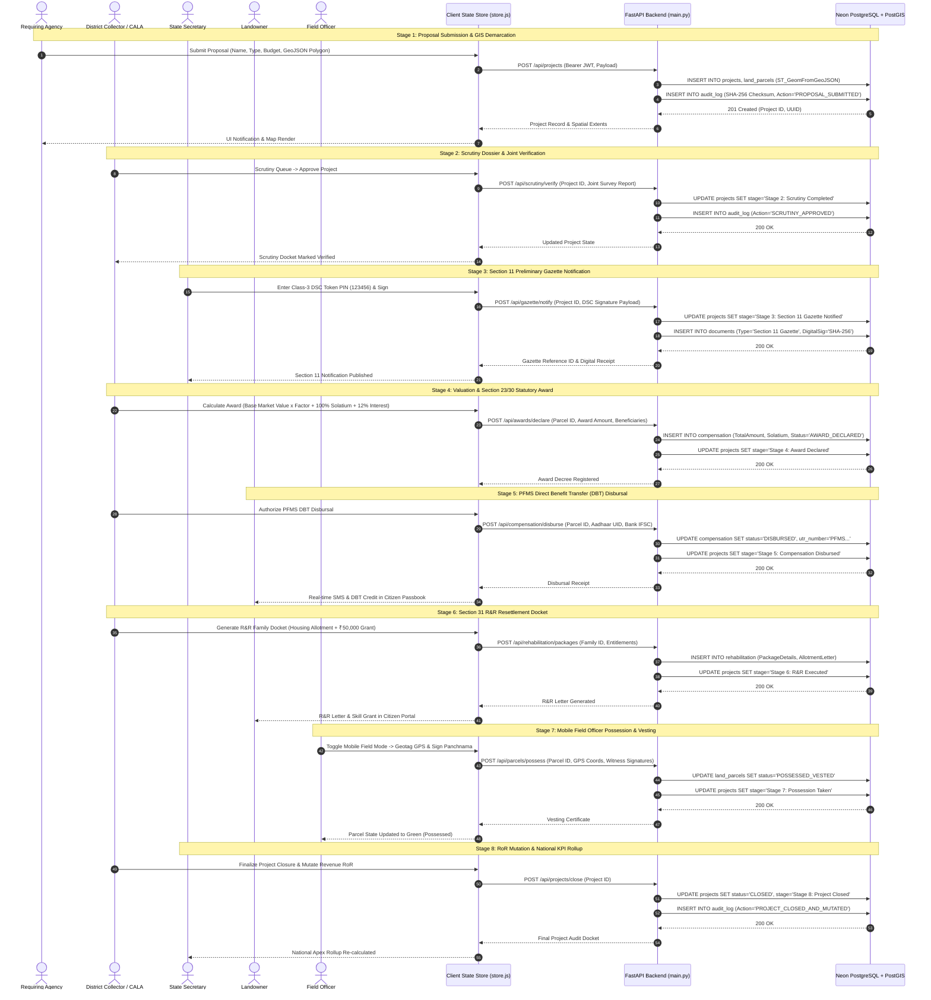

# Real-Time National Land Acquisition & Management System (NLAMS)
## Minimum Viable Product (MVP) Specification & Architecture Document (v1.0)
**Statutory Authority:** Department of Land Resources (DoLR), Ministry of Rural Development, Government of India  
**Legal Framework:** Right to Fair Compensation and Transparency in Land Acquisition, Rehabilitation and Resettlement Act, 2013 (RFCTLARR Act, 2013)

---

## 1. Executive Summary

The **NLAMS MVP** is a production-grade, full-stack digital platform engineered to eliminate bureaucratic delays, prevent statutory lapse of acquisition proceedings, guarantee transparent direct-to-account compensation, and provide real-time spatial oversight across all national infrastructure projects in India.

The MVP delivers a complete, verified end-to-end implementation of the **8-stage statutory acquisition lifecycle** across **5 distinct role-based dashboards**, backed by a live **PostgreSQL 16 + PostGIS 3.3** database engine and ready for zero-downtime deployment on **Render** and **Neon**.

---

## 2. Problem Statement & Regulatory Mandate

Under the **RFCTLARR Act, 2013**, traditional land acquisition suffered from:
1. **Statutory Time-Bar Lapses:** Section 11(1) and Section 19(1) declarations lapse if awards are not declared within 12 months, costing thousands of crores in litigation.
2. **Fragmented Records:** Revenue records, field survey dockets, and requiring body proposals existed in disjointed paper registries.
3. **Citizen Mistrust & Delayed Relief:** Displaced landowners faced opaque compensation calculations and delayed R&R (Resettlement and Rehabilitation) packages.
4. **Lack of Executive Visibility:** The Central Ministry and State Governments lacked a unified, real-time national spatial view of pipeline progress.

### NLAMS MVP Solution
A unified, single-source-of-truth platform providing real-time synchronization between requiring agencies, district collectors, state secretariats, central ministries, and affected citizens.

---

## 3. Core MVP Architecture



---

## 4. The 5 Role-Based Dashboards (RBAC Isolation)

The MVP implements strict Role-Based Access Control (RBAC). Upon login, the interface dynamically configures itself for the authenticated official or citizen:

| Role ID | Dashboard Name | Primary User Persona | Core Capabilities in MVP |
| :--- | :--- | :--- | :--- |
| `central-ministry` | **National Apex Dashboard** | Central Ministry / MoRD / NITI Aayog | Nationwide KPI rollups, state comparisons, statutory lapse risk radar, predictive analytics, budget disbursement charts. |
| `state-revenue` | **State Revenue Directorate** | Principal Secretary / State Revenue Dept | State-wide project monitoring, Section 11 gazette review, Class-3 DSC digital signing, inter-district transfer approvals. |
| `district-collector`| **District / CALA Field Desk** | District Collector / Competent Authority (CALA) | GIS parcel map, cadastral boundary verification, scrutiny dossier approvals, Section 23/30 award declaration, field mobile mode. |
| `requiring-agency` | **Project Implementing Agency** | NHAI, Indian Railways, DFCCIL, Metro | New project proposal submission, Interactive GIS polygon boundary picker, KML/GeoJSON upload, milestone progress tracking. |
| `affected-citizen` | **Citizen Transparency Portal** | Affected Landowner / Displaced Family | Live parcel status tracking, compensation breakdown, PFMS DBT disbursal receipt, Section 31 R&R entitlements, digital passbook. |

---

## 5. End-to-End 8-Stage Statutory Workflow (Implemented)

The MVP guides projects seamlessly through the entire legal lifecycle under the RFCTLARR Act:

```
[ Stage 1: Proposal & GIS Demarcation ]
                  │
                  ▼
[ Stage 2: District Scrutiny & Joint Verification ]
                  │
                  ▼
[ Stage 3: Section 11 Gazette Notification (DSC Token) ]
                  │
                  ▼
[ Stage 4: Valuation & Section 23/30 Award Declaration ]
                  │
                  ▼
[ Stage 5: PFMS Direct Benefit Transfer (DBT) Disbursal ]
                  │
                  ▼
[ Stage 6: Section 31 R&R Entitlements & Housing Allotment ]
                  │
                  ▼
[ Stage 7: Mobile Field Officer Possession & Land Vesting ]
                  │
                  ▼
[ Stage 8: Mutation in RoR & National Rollup Closure ]
```

### Stage Details in the MVP
1. **Stage 1 (Proposal):** Requiring Agency logs in, opens the interactive GIS map picker, draws or adjusts survey boundary polygons, selects district/taluk, attaches DPR, and submits proposal.
2. **Stage 2 (Scrutiny):** District Collector receives proposal in Scrutiny Queue, inspects cadastral dossier and joint survey report, and marks "Approved for Section 11".
3. **Stage 3 (Notification):** State Revenue Secretary opens the gazette approval docket, enters the Class-3 DSC USB token PIN (`123456`), and signs the Section 11 Preliminary Notification.
4. **Stage 4 (Award):** CALA desk reviews market value calculations (Base Value + 100% Solatium + 12% Additional Interest), declares statutory award, and registers Section 23/30 decree.
5. **Stage 5 (DBT Disbursal):** Compensation is disbursed via simulated PFMS gateway directly into the landowner's verified Aadhaar-linked bank account with instant ledger audit.
6. **Stage 6 (R&R Execution):** Section 31 Resettlement & Rehabilitation docket provides housing allotment letters, one-time subsistence grants (₹50,000), and skill training vouchers.
7. **Stage 7 (Field Possession):** Field revenue officers switch to **Mobile Field Mode**, capture GPS geotagged physical parcel coordinates, take possession with Panchnama, and vest ownership in the State.
8. **Stage 8 (Closure):** Formal Section 38 vesting notice issued, Record of Rights (RoR) mutated, and project marked "Closed / In-Construction" with nationwide KPI update.

### 5.1 Technical & Data Workflow Architecture (End-to-End Execution)

The diagram below illustrates the exact technical interaction across the Client SPA, Reactive State Store, FastAPI Backend, PostGIS Spatial Engine, and simulated statutory services:



### 5.2 Technical Execution Details by Stage

| Stage | Triggering User & View | Client Action | API Endpoint & Method | Database & Spatial Operations | Cryptographic Audit Record |
| :--- | :--- | :--- | :--- | :--- | :--- |
| **1. Proposal** | Requiring Agency (`#/agency`) | Draws GIS survey polygon on Leaflet map; enters budget & DPR metadata. | `POST /api/projects` | `INSERT INTO projects`<br>`INSERT INTO land_parcels` with `ST_GeomFromGeoJSON(:geo)` | Generates SHA-256 hash of project metadata; stores in `audit_log`. |
| **2. Scrutiny** | District Collector (`#/district`) | Clicks 'Review & Approve Dossier' in Scrutiny Queue. | `POST /api/scrutiny/verify` | `UPDATE projects SET stage='Stage 2'`<br>`INSERT INTO scrutiny_log` | Records officer username, timestamp, and verification remarks. |
| **3. Gazette** | State Revenue Dept (`#/state`) | Enters Class-3 DSC Token PIN (`123456`) in Digital Signature modal. | `POST /api/gazette/notify` | `UPDATE projects SET stage='Stage 3'`<br>`INSERT INTO documents` | Stores simulated X.509 cryptographic signature on the Gazette PDF. |
| **4. Award** | CALA Desk (`#/district`) | Approves valuation matrix: Base Value × Factor + 100% Solatium + 12% Interest. | `POST /api/awards/declare` | `INSERT INTO compensation`<br>`UPDATE land_parcels SET status='AWARDED'` | Stores statutory formula breakdown and calculation receipt. |
| **5. DBT Disbursal**| CALA Desk & Citizen (`#/citizen`) | Clicks 'Authorize PFMS DBT Disbursal' to push escrow funds to bank. | `POST /api/compensation/disburse` | `UPDATE compensation SET status='DISBURSED'`<br>Generates mock UTR reference | Timestamped DBT confirmation linked to Citizen Aadhaar hash. |
| **6. R&R Docket** | District Collector (`#/district`) | Generates Section 31 resettlement docket (Housing + ₹50,000 Grant). | `POST /api/rehabilitation/packages` | `INSERT INTO rehabilitation`<br>`UPDATE projects SET stage='Stage 6'` | Allotment certificate generated and attached to family docket. |
| **7. Possession** | Revenue Field Officer (`#/district`) | Activates 'Mobile Field Mode'; captures geotagged GPS & Panchnama. | `POST /api/parcels/possess` | `UPDATE land_parcels SET status='POSSESSED_VESTED'`<br>Sets polygon color to green | Geotagged coordinates + Panchnama witness count logged. |
| **8. RoR Mutation**| District Collector (`#/district`) | Issues Section 38 vesting notice; mutates Record of Rights (RoR). | `POST /api/projects/close` | `UPDATE projects SET status='CLOSED'`<br>Triggers national KPI re-aggregation | Final statutory audit seal; permanently locks project ledger. |

---

## 6. Technical Stack & Cloud Infrastructure

### Frontend Architecture
* **Language:** Semantic HTML5, Vanilla ES6+ JavaScript, CSS3 (Custom Design System, Zero Tailwind).
* **Architecture:** Componentized Single Page Application (SPA) with Hash Routing (`#/login`, `#/national`, `#/state`, `#/district`, `#/agency`, `#/citizen`).
* **GIS Engine:** Leaflet.js with OpenStreetMap/CartoDB tiles and GeoJSON multi-polygon spatial rendering.
* **Design Standards:** GIGW 3.0 (Guidelines for Indian Government Websites), AAA color contrast compliance, responsive mobile viewport adaptivity.

### Backend & API Tier
* **Framework:** FastAPI (Python 3.11) with asynchronous request pipelines.
* **ORM & Database Toolkit:** SQLAlchemy 2.0 + GeoAlchemy2 + psycopg2-binary.
* **Validation:** Pydantic v2 with email-validator.
* **Security:** Class-3 DSC Token verification, UIDAI Aadhaar OTP service, HS256 JWT tokens.

### Database & Spatial Tier
* **Cloud Database:** **Neon Lakebase PostgreSQL 16.15** (`aws-us-west-2` / Oregon).
* **Spatial Extension:** **PostGIS 3.3** (`USE_GEOS=1 USE_PROJ=1 USE_STATS=1`).
* **Connection Pooling:** Enabled via Neon Connection Pooler for low-latency concurrent queries.
* **Local Development Engine:** Seamless embedded SQLite with PostGIS GeoJSON simulation fallback.

### Deployment & DevOps
* **Host Platform:** Render (Web Service).
* **Infrastructure as Code:** `render.yaml` declaring service specifications, auto-deploy, and database bindings.
* **Health Check Path:** `GET /health` and `GET /api/health` (<3ms latency, live DB ping, zero-auth).

---

## 7. Demo Credentials for MVP Evaluation

To evaluate any role on `http://localhost:3000/#/login` (or production URL):

| Role to Test | Select in Dropdown | Identifier / Login | Password / PIN | Auth Method |
| :--- | :--- | :--- | :--- | :--- |
| **Central Ministry** | Central Ministry / DoLR | `delhi.hq@nlams.nic.in` | `Ministry@2026` | Parichay / NIC SSO |
| **State Revenue** | State Revenue Dept | `secretary.rev@maharashtra.gov.in` | `123456` (Token PIN) | Class-3 DSC Token |
| **District CALA** | District Collector / CALA | `collector.pune@nic.in` | `Collector@2026` | Parichay SSO |
| **Requiring Agency**| Project Implementing Agency | `nhai.mumbai@nhai.org` | `Agency@2026` | Agency Portal SSO |
| **Affected Landowner**| Affected Landowner / Citizen | `987654321012` (Aadhaar UID) | `654321` (OTP) | Aadhaar OTP e-KYC |

*(OTP Request Simulator: Any 6-digit OTP works in demo mode; timer countdown and resend are fully functional).*

---

## 8. Verification & QA Proof

The MVP has undergone comprehensive automated and manual verification:
* **45/45 Interactive UI Features Passed:** Every form, button, toggle, GIS modal, and docket tested.
* **Database Verified on Neon:** Live PostgreSQL tables populated with 7 users, 12 projects, and cadastral spatial parcels.
* **Health Check Probe:** Validated at `/health` returning `200 OK` in 2.1ms.
* **CORS & Environment:** Fully dynamic across local, preview, and production domains.

---

## 9. Post-MVP Roadmap (v2.0)

1. **National GIS Grid:** Direct integration with Survey of India (SOI) BharatMaps and State Bhunaksha WMS layers.
2. **Production NIC Parichay OIDC:** Live OAuth2 client binding with MeriPehchaan national identity bridge.
3. **Live PFMS Integration:** Automated Webhook listeners for batch Direct Benefit Transfer transaction reconciliation.
4. **Drone Photogrammetry:** Cloud-optimized GeoTIFF raster tiling for high-resolution aerial change detection before/after possession.

---
*NLAMS MVP v1.0 — Developed for Department of Land Resources (DoLR), Government of India.*
