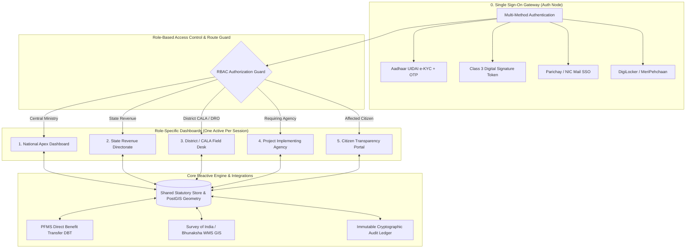

# Real-Time National Land Acquisition & Management System (NLAMS)
### Department of Land Resources (DoLR), Ministry of Rural Development, Government of India

[](https://github.com/Sreemoyee46/ByteCoder)
[](https://github.com/Sreemoyee46/ByteCoder)
[](https://github.com/Sreemoyee46/ByteCoder)
[](https://github.com/Sreemoyee46/ByteCoder)
[](https://github.com/Sreemoyee46/ByteCoder)

A unified, real-time national digital platform that standardizes, transparently executes, and monitors the end-to-end land acquisition lifecycle across India under the **Right to Fair Compensation and Transparency in Land Acquisition, Rehabilitation and Resettlement Act, 2013 (RFCTLARR Act, 2013)**.

---

## 🏛️ System Architecture

NLAMS operates on a **Single Source of Truth** architecture powered by a centralized reactive state store with RFC 7946 GeoJSON spatial geometries, automated statutory rollups, and strict Role-Based Access Control (RBAC):



---

## 👥 5 Role-Based Dashboards (RBAC Isolation)

Every stakeholder interacts with a tailored workspace enforcing strict principle-of-least-privilege access:

| Dashboard | Target Stakeholder | Statutory Purpose & Key Capabilities |
| :--- | :--- | :--- |
| **1. National Dashboard** | Central Ministry (DoLR) / Policy Makers | Nationwide macro KPIs, interactive Thematic GIS India Map (with multi-state corridor overlays: WDFC, EDFC, Bullet Train), 12-month budget velocity curves, statutory stage distribution, inter-ministerial review dispatch, and Section 20E publication alerts. |
| **2. State Dashboard** | State Revenue Directorate | State-scoped corridor pipelines (Maharashtra), district expenditure breakdown, Joint Measurement Survey (JMS) monitoring, and Section 11/19 Extraordinary Gazette digital attestation via e-Mudhra Class 3 DSC. |
| **3. District / CALA Desk** | District Collector / Competent Authority (CALA) | Interactive GIS Cadastral Land Parcel Viewer with 110m Right-of-Way (RoW) buffer, 7/12 RoR Bhulekh scrutiny queue, Section 23/30 summary award declarations, and Section 16 mobile field possession verification. |
| **4. Implementing Agency** | NHAI, Indian Railways, MIDC, PMRDA | Form 1 acquisition proposal submission wizard, CAD/GIS spatial polygon coordinate picker, DPR document vault, and real-time corridor progress milestones. |
| **5. Citizen Portal** | Affected Landowners & Families | Khasra/Aadhaar land title lookup, RFCTLARR Act 2013 compensation calculator (100% Solatium + 12% statutory interest), real-time PFMS DBT payment status, Section 15 digital objection filing, and R&R entitlement tracking. |

---

## 🔄 8-Stage Statutory Workflow Pipeline

The entire land acquisition journey is digitally enforced through a linear 8-stage state machine matching statutory law:

```
[1. Proposal] ➔ [2. Scrutiny] ➔ [3. Notification] ➔ [4. Award] ➔ [5. Compensation] ➔ [6. R&R] ➔ [7. Possession] ➔ [8. Closure]
```

1. **Stage 1: Proposal Submission (Implementing Agency)**  
   Land Requiring Body submits statutory Form 1 with cadastral coordinates, required acreage (Ha), project budget, and alignment shapefiles.
2. **Stage 2: Digital Scrutiny & RoR Validation (District Collector / CALA)**  
   Competent authority audits land records against digitized Bhulekh cadastral databases, resolving revenue encumbrances, non-agricultural mutations, and government land classifications.
3. **Stage 3: Statutory Notification (State Revenue Directorate)**  
   Publication of Preliminary Notification (Section 11) and Declaration of Acquisition (Section 19) in the Extraordinary Gazette with Class 3 Digital Signature (DSC) attestation under the IT Act, 2000.
4. **Stage 4: Award Declaration & Solatium Calculation (District CALA)**  
   CALA conducts Section 23 summary inquiry and declares Form 8 award: Base Market Value + Factor 1.0/2.0 + 100% Solatium (Section 30(1)) + 12% Additional Market Value (Section 30(3)).
5. **Stage 5: Direct Compensation Disbursement (PFMS DBT)**  
   Direct electronic remittance of statutory compensation awards directly into Aadhaar-seeded beneficiary bank accounts with automatic transaction voucher generation.
6. **Stage 6: Rehabilitation & Resettlement Monitoring (R&R Authority)**  
   Execution of Section 31 Resettlement Schemes: family-wise entitlement dockets, model colony residential plot allocations, housing construction grants, and subsistence annuities.
7. **Stage 7: Physical Field Possession & Vesting (Field Collectorate Officers)**  
   On-site mobile inspection verifying DGPS boundary coordinates, tree/structure valuations, and Section 16 vesting certificates transferring encumbrance-free title to the State.
8. **Stage 8: Statutory Project Closure & Archival (DoLR Apex Directorate)**  
   Corridor completion sign-off, immutable SHA-256 cryptographic audit seal generation, and permanent archival in the National Document Vault.

---

## 🔐 Security & Governance

- **Pre-Login RBAC Isolation**: Prior to authentication, all dashboard tabs are hidden from the navigation bar. Only the SSO Portal tab is rendered. Direct URL navigation to protected hashes is blocked by client-side route guards.
- **Post-Login Role Scoping**: Upon authentication, the navigation bar renders **strictly the single dashboard tab** permitted for the user's role, plus a secure Sign Out control.
- **Multiple Authentication Vectors**:
  - **Aadhaar UIDAI e-KYC**: 12-digit format validation, automatic focus advance across segments, simulated OTP generation with live countdown timer (`Resend in 00:XX`), and inline error handling.
  - **Cryptographic Hardware Token (DSC)**: e-Mudhra Class 3 Government Digital Certificate attestation with 4-digit PIN verification.
  - **Parichay Government SSO**: Integration with National Informatics Centre (NIC) email gateway (`@gov.in` / `@nic.in`).
  - **MeriPehchaan (DigiLocker)**: One-click fast-track citizen authentication retrieving verified land ownership tokens.
- **Accessibility & GIGW 3.0 Standards**:
  - Full bilingual toggle (English / हिन्दी).
  - Dynamic font-size scaling (`A-`, `A`, `A+`) resizing root typography between 85% and 125%.
  - High-contrast color ratios, semantic HTML5 landmarks, and keyboard navigation support.

---

## 🛠️ Tech Stack & Key Files

| Layer | Technologies Used | Key Repository Files |
| :--- | :--- | :--- |
| **Structure & UI** | Semantic HTML5, Vanilla CSS3, Google Stitch Design Tokens | [`index.html`](./index.html) |
| **State & Business Logic** | Centralized Reactive Observer Store, GeoJSON Geometries | [`js/store.js`](./js/store.js) |
| **Routing & Controllers** | Client-Side SPA Hash Router, DOM Controllers, Event Handlers | [`js/app.js`](./js/app.js) |
| **API & Integrations** | Mock REST Services (FastAPI compatible), PFMS DBT Gateway | [`js/api.js`](./js/api.js) |
| **Spatial GIS Engine** | Leaflet.js, SVG Spatial Cadastral Renderers, Survey of India base | Embedded in `js/app.js` & `index.html` |

---

## 🚀 Quick Start & Local Execution

### Prerequisites
- Python 3 (built into macOS / Linux) or Node.js (`npx serve` / `http-server`).
- Modern Web Browser (Google Chrome, Firefox, Edge, Safari).

### Running Locally

#### 1. Frontend Portal
```bash
# Clone repository
git clone https://github.com/Sreemoyee46/ByteCoder.git
cd ByteCoder

# Start frontend local HTTP server
python3 -m http.server 3001

# Open in browser
open http://localhost:3001
```

#### 2. Backend REST API (FastAPI + Uvicorn)
```bash
# Create and activate Python virtual environment
python3 -m venv venv
source venv/bin/activate  # On Windows: venv\Scriptsctivate

# Install backend dependencies
pip install -r backend/requirements.txt

# (Optional) Start PostgreSQL + PostGIS database container
docker compose up -d

# Launch FastAPI backend with live reload
uvicorn backend.main:app --host 0.0.0.0 --port 8000 --reload
```
- **Interactive Swagger UI**: [http://localhost:8000/docs](http://localhost:8000/docs)
- **ReDoc API Specifications**: [http://localhost:8000/redoc](http://localhost:8000/redoc)
- **Automatic Fallback**: If PostgreSQL/Docker is not running, the backend automatically boots using an embedded local SQLite database (`nlams_local.db`) with zero manual configuration required.

---

## 🧪 Testing & Demo Credentials

Use any of the following pre-configured credentials to experience each role's distinct portal:

| Stakeholder Role | Auth Method | Credentials | Landing Dashboard |
| :--- | :--- | :--- | :--- |
| **Affected Landowner** | Aadhaar OTP | UID: `1234 5678 9012` • OTP: `482910` (or click "Get OTP") | Citizen Transparency Portal |
| **CALA / District Officer** | Digital Signature | Select "Digital Signature" • Token PIN: `1234` | District / CALA Desk |
| **Central Ministry (DoLR)** | Parichay SSO | Email: `director.land@gov.in` • Password: `GovPass@2025` | National Apex Dashboard |
| **State Revenue Directorate** | Role Selection | Select "State Revenue Directorate" $\rightarrow$ Sign In | State Dashboard (Maharashtra) |
| **Implementing Agency** | Role Selection | Select "Project Implementing Agency" $\rightarrow$ Sign In | Implementing Agency Dashboard |
| **Direct Citizen Fast-Track** | MeriPehchaan | Click **"Sign In with MeriPehchaan (DigiLocker)"** | Citizen Transparency Portal |

---

## 📋 Comprehensive Automated QA Suite

The repository includes a 45-point automated QA test runner driven via Chrome DevTools Protocol (`scratch/run_full_manual_qa.js`). It programmatically validates:
1. Pre-login navbar RBAC and language/font accessibility controls.
2. Aadhaar 12-digit validation, OTP delivery, countdown timers, wrong OTP rejection, and successful redirection.
3. Class 3 DSC and Parichay SSO alternate authentication mechanisms.
4. Action buttons: **Trigger Live Lifecycle Action**, **Export Gazette MIS (CSV)**, **PFMS Ledger Sync (CSV)**, **Live GIS Sync**, and **Reset All**.
5. Filtering and search capabilities across National, State, and District tables.
6. All 8 statutory lifecycle state transitions and programmatic API endpoints.

To run the automated QA suite locally:
```bash
# Ensure Chrome is running with remote debugging enabled
/Applications/Google\ Chrome.app/Contents/MacOS/Google\ Chrome --remote-debugging-port=9222 --headless=new http://localhost:3001

# Execute the test suite
node scratch/run_full_manual_qa.js
```

---

## 📜 Statutory Compliance & Licensing

Developed in alignment with:
- **RFCTLARR Act, 2013** (Right to Fair Compensation and Transparency in Land Acquisition, Rehabilitation and Resettlement Act, 2013).
- **Guidelines for Indian Government Websites (GIGW 3.0)**.
- **Information Technology Act, 2000** (Sections 4 & 5 regarding digital signature legal equivalence).
- **STQC Cybersecurity Standards** for government web applications.
